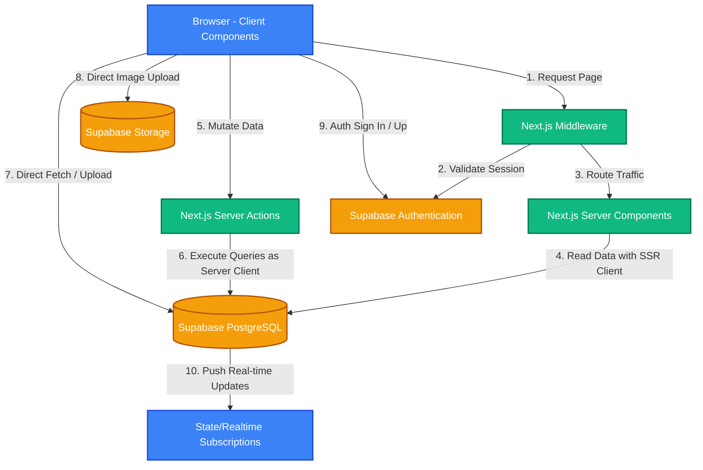
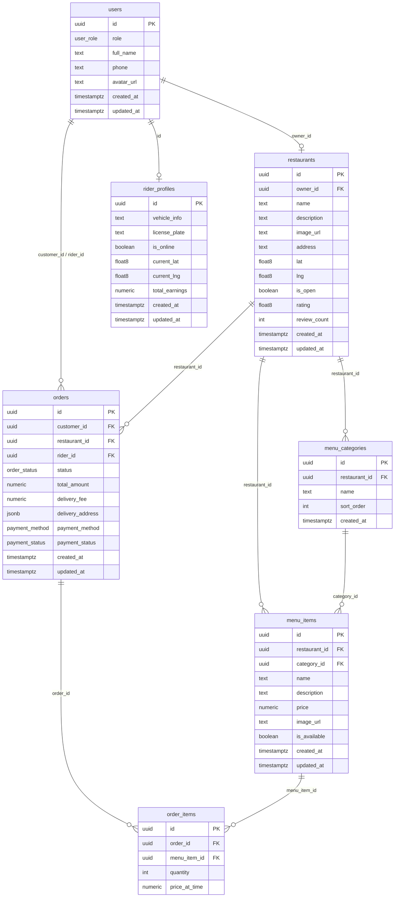

# 📐 เอกสารสถาปัตยกรรมซอฟต์แวร์ (Software Architecture Document)

เอกสารนี้ระบุรายละเอียดโครงสร้างสถาปัตยกรรมซอฟต์แวร์ การจัดการฐานข้อมูล และระบบสิทธิ์ความปลอดภัยของแอปพลิเคชัน **Project Thunder Food** ตามมาตรฐานอุตสาหกรรมในปัจจุบัน เพื่อความโปร่งใส ปลอดภัย และบำรุงรักษาได้ง่ายในระยะยาว

---

## 1. 🏗️ สถาปัตยกรรมระบบโดยรวม (System Architecture Overview)

แอปพลิเคชันได้รับการออกแบบตามรูปแบบ **Hybrid Modern SSR (Server-Side Rendering)** ที่ขับเคลื่อนด้วย Next.js 16 App Router และทำงานร่วมกับ Supabase Backend-as-a-Service (BaaS) 

### การจัดสรรขอบเขตการประมวลผล (Rendering Boundaries):
1.  **Next.js Middleware (`utils/supabase/middleware.ts`):** 
    *   ทำหน้าที่เป็นด่านหน้าคอยตรวจจับ HTTP Requests ทุกตัว
    *   ทำหน้าที่รีเฟรช JWT token ของ Supabase โดยอัตโนมัติในฝั่งเซิร์ฟเวอร์ก่อนโหลดหน้าเพจ
    *   จัดการเรื่อง Route Protection ป้องกันการเข้าถึงพื้นที่ที่มีความสำคัญ (เช่น ผู้ใช้ทั่วไปพยายามเข้าหน้า `/admin` หรือ `/restaurant`)
2.  **Next.js Server Components:**
    *   ทำหน้าที่ดึงข้อมูลเบื้องต้นจากตารางฐานข้อมูลโดยตรงผ่าน `createServerClient` เพื่อทำ Server-Side Rendering (SSR) 
    *   ช่วยเพิ่มความเร็วในการดาวน์โหลดหน้าแรก (First Contentful Paint) และเพิ่มความปลอดภัยโดยไม่ต้องเปิดเผย Client-Side Fetching APIs ไปยังหน้าเบราว์เซอร์
3.  **Next.js Server Actions (`app/actions/`):**
    *   ทำหน้าที่เป็น Endpoints สำหรับบันทึก แก้ไข หรือยกเลิกข้อมูล (Data Mutations)
    *   รันแบบ Secure ฝั่ง Server เพื่อหลีกเลี่ยงช่องโหว่ความปลอดภัยที่พบบ่อย เช่น การส่งคำสั่งโดยตรงจากไคลเอนต์ (SQL Injection)
4.  **Client Components (`'use client'`):**
    *   รับผิดชอบการสร้าง Interactive UI ที่ต้องตอบสนองฉับพลัน เช่น ตะกร้าสินค้า การเลื่อนเมนูอาหาร และการแสดงแผนที่
    *   เชื่อมต่อโดยตรงกับ Supabase Realtime Channels เพื่อคอยดึงความคืบหน้าของคำสั่งซื้อที่เกิดขึ้นจริง

---

## 2. 🗄️ โครงสร้างและการออกแบบฐานข้อมูล (Database Relational Schema)

ฐานข้อมูลทำงานอยู่บน **PostgreSQL** บนบริการของ Supabase ซึ่งออกแบบให้มีความสัมพันธ์กัน (Relational Database) และสร้างความปลอดภัยผ่านกลไกความสัมพันธ์คีย์นอก (Foreign Keys) ดังแผนภาพนี้:

### รายละเอียดโครงสร้างตารางข้อมูลหลัก:
1.  **users (ตารางโปรไฟล์ผู้ใช้งาน):** 
    *   ทำหน้าที่จัดเก็บโปรไฟล์สาธารณะของผู้ใช้งาน เชื่อมโยงแบบ `1:1` กับข้อมูลในตาราง `auth.users` ของ Supabase
    *   ใช้ตัวแปรแบบ `user_role` (enum) ประกอบไปด้วย `customer`, `restaurant`, `rider`, `admin`
2.  **restaurants (ตารางร้านอาหาร):**
    *   เป็นตารางแสดงรายละเอียดร้านอาหาร โดยที่ `owner_id` เชื่อมโยงกับ `users(id)` และถูกกำหนดให้มีสิทธิ์เป็น `restaurant` เท่านั้น
    *   เก็บพิกัดละติจูดและลองจิจูด (`lat`, `lng`) ในรูปแบบ `float8` เพื่อนำไปคำนวณระยะทางและค่าจัดส่งแบบพรีเมียม
3.  **menu_items (ตารางรายการอาหาร):**
    *   ผูกอยู่กับร้านค้า (`restaurant_id`) และหมวดหมู่อาหาร (`category_id`)
    *   ใช้การทำ `on delete cascade` บนคีย์นอกของร้านอาหาร เมื่อร้านอาหารถูกลบ รายการอาหารที่เกี่ยวข้องจะถูกลบตามโดยอัตโนมัติ เพื่อป้องกันการตกค้างของข้อมูลขยะ (Orphaned Rows)
4.  **orders (ตารางประวัติการสั่งอาหาร):**
    *   รวบรวมข้อมูลผู้สั่งซื้อ (`customer_id`), ร้านผู้รับสั่ง (`restaurant_id`) และผู้จัดส่ง (`rider_id`)
    *   ตัวแปรสถานะ `order_status` (enum) ได้แก่: `pending` (รอรับ) ➡️ `preparing` (กำลังปรุง) ➡️ `ready` (ปรุงเสร็จพร้อมส่ง) ➡️ `picking_up` (ไรเดอร์กำลังมารับ) ➡️ `delivering` (กำลังจัดส่ง) ➡️ `completed` (ส่งงานเรียบร้อย) ➡️ `cancelled` (คำสั่งซื้อยกเลิก)
    *   จัดเก็บข้อมูลที่อยู่จัดส่งในรูปแบบ `jsonb` เพื่อความยืดหยุ่น เช่น เก็บทั้งพิกัดแผนที่ ที่อยู่อย่างละเอียด และรายละเอียดข้อความสั่งเพิ่มเติม
5.  **order_items (ตารางแสดงรายละเอียดสินค้าในคำสั่งซื้อ):**
    *   เก็บรายการย่อยที่ระบุในคำสั่งซื้อ โดยจัดเก็บราคาจริง ณ เวลาสั่งซื้อ (`price_at_time`) เพื่อป้องกันข้อผิดพลาดกรณีที่ร้านอาหารแก้ไขราคาของเมนูในอนาคต

---

## 3. 🔒 นโยบายควบคุมความปลอดภัยฐานข้อมูล (Row-Level Security - RLS Policies)

ความปลอดภัยในฐานข้อมูลไม่ได้ขึ้นอยู่กับการกรองข้อมูลที่โค้ดหน้าบ้านเพียงอย่างเดียว แต่ถูกบังคับใช้ตั้งแต่ระดับเอนจินของฐานข้อมูลด้วยระบบ **Row-Level Security (RLS)** ของ PostgreSQL ทุกตารางได้รับการเปิดใช้งานและตรวจสอบสิทธิ์อย่างเข้มข้น:

### นโยบายสิทธิ์การเข้าถึงข้อมูลของตารางหลัก (RLS Matrix):

| ตาราง (Table) | การเลือกอ่าน (SELECT) | การเพิ่มข้อมูล (INSERT) | การปรับปรุงข้อมูล (UPDATE) | การลบข้อมูล (DELETE) |
| :--- | :--- | :--- | :--- | :--- |
| **users** | ทุกคนที่ล็อกอินอ่านได้ | เฉพาะระบบกลาง (Trigger) | เฉพาะเจ้าของไอดีเท่านั้น | ไม่อนุญาต |
| **restaurants** | ทุกคนอ่านได้ (สาธารณะ) | เฉพาะเจ้าของที่มีบทบาท `restaurant` หรือ `admin` | เฉพาะเจ้าของร้านเท่านั้น | เฉพาะ `admin` |
| **menu_items** | ทุกคนอ่านได้ (สาธารณะ) | เฉพาะเจ้าของร้านอาหารเท่านั้น | เฉพาะเจ้าของร้านอาหารเท่านั้น | เฉพาะเจ้าของร้านอาหารเท่านั้น |
| **orders** | เจ้าของคำสั่งซื้อ, เจ้าของร้าน, ไรเดอร์ที่รับงาน หรือ `admin` | เฉพาะผู้ใช้ที่เป็น `customer` (สั่งของตนเอง) | เจ้าของร้าน (ปรุงอาหาร), ไรเดอร์ (เปลี่ยนสถานะส่ง), ลูกค้า (ยกเลิกก่อนรับงาน) | ไม่อนุญาต |
| **rider_profiles** | ทุกคนอ่านได้ | เฉพาะระบบกลาง (Trigger) | เฉพาะตัวไรเดอร์เองเท่านั้น | ไม่อนุญาต |

### การจำกัดบทบาทและความปลอดภัยขั้นสูง (Advanced Security Hardening):
1.  **Security Definer Functions:** ฟังก์ชันของระบบที่มีความสำคัญ (เช่น ฟังก์ชันสำหรับตรวจสอบความเป็นแอดมิน `is_admin()` หรือฟังก์ชันสร้างบัญชีอัตโนมัติ `handle_new_user()`) จะถูกตัดสิทธิ์จากการรันผ่านบัญชีสาธารณะ (`PUBLIC`) ทันที และอนุญาตให้รันเฉพาะบทบาทที่ได้รับอนุญาตอย่างชัดเจน (`authenticated` หรือ `service_role` ของระบบ) เพื่อสกัดกั้นการแฮกเกอร์ส่งคำสั่งมาแก้ไขข้อมูล
2.  **Schema isolation:** ฟังก์ชันการตรวจสอบทั้งหมดถูกตีกรอบให้อยู่ในสคีมาของ PostgreSQL ที่ปลอดภัยและจำกัด `search_path` ไว้อย่างชัดเจนเพื่อป้องกันสิทธิพิเศษเกินกำหนด (Privilege Escalation Attacks)

---

## 4. ⚡ ระบบเรียลไทม์และการอัปเดตอัตโนมัติ (Real-time Pipeline)

หนึ่งในจุดเด่นของระบบคือความเร็วระดับพรีเมียม โดยไม่มีการเรียกขอข้อมูลใหม่ซ้ำๆ แบบไร้ประสิทธิภาพ (Pollings) แอปพลิเคชันประยุกต์ใช้ **Supabase Realtime Engine (WAL - Write Ahead Log listener)** โดยทำการเปิดใช้งานการกระจายข่าวสาร (Publication) กับ 2 ตารางหลัก ได้แก่:

1.  **ตาราง `public.orders`:** 
    *   เมื่อลูกค้ากดสั่งซื้อ ➡️ ระบบร้านค้าจะได้รับคำสั่งซื้อแสดงบนหน้าจอทันทีโดยไม่ต้องกดรีเฟรชหน้าเว็บ
    *   เมื่อร้านค้ากดว่าอาหารปรุงเสร็จ ➡️ ระบบไรเดอร์จะแสดงสถานะอัปเดตงานบนกระดานประกาศทันที
    *   เมื่อไรเดอร์เข้าใกล้หรือเปลี่ยนสถานะจัดส่ง ➡️ โทรศัพท์ของลูกค้าจะส่งเสียงและแจ้งเตือนสถานะทันที
2.  **ตาราง `public.rider_profiles`:**
    *   คอยกระจายข้อมูลตำแหน่งละติจูด/ลองจิจูดล่าสุดของไรเดอร์ (`current_lat`, `current_lng`) ขณะออกเดินทาง ทำให้แผนที่บนหน้าจอลูกค้าเกิดอนิเมชันขยับตามพิกัดจริงบนแผนที่แบบ Real-time

---

## 5. 🤖 ระบบอัตโนมัติของฐานข้อมูล (Database Triggers)

เพื่อลดภาระงานของการประมวลผลฝั่ง Next.js เซิร์ฟเวอร์ และรักษาความคงสภาพของข้อมูลอย่างสมบูรณ์แบบ (Data Integrity) ฐานข้อมูลมี **SQL Triggers** คอยจัดระเบียบข้อมูลเบื้องหลังโดยอัตโนมัติ:

1.  **ระบบสร้างผู้ใช้งานอัตโนมัติ (`on_auth_user_created`):**
    *   เมื่อมีบัญชีใหม่สมัครสมาชิกเข้ามาในระบบผ่าน Supabase Auth ฟังก์ชันจะดึงข้อมูลเมทาดาตาของอีเมล รูปโปรไฟล์ และสิทธิ์ (`role`) ที่ถูกระบุไว้
    *   สร้างแถวข้อมูลใหม่ในตาราง `public.users` ทันทีแบบอัตโนมัติ
    *   หากผู้ใช้งานลงทะเบียนด้วยสิทธิ์ไรเดอร์ (`rider`) ระบบตัวกระตุ้นจะสร้างข้อมูลว่างลงในตาราง `public.rider_profiles` เพื่อเตรียมรองรับการทำงานของไรเดอร์และป้องกันข้อผิดพลาด `NULL` ขณะเปิดแอปร้านหรือตรวจสอบตำแหน่งไรเดอร์
2.  **ระบบบันทึกเวลาแก้ไขล่าสุดอัตโนมัติ (`handle_updated_at`):**
    *   ทุกครั้งที่มีการรันคำสั่ง `UPDATE` บนตารางหลัก (`users`, `restaurants`, `menu_items`, `orders`, `rider_profiles`) ฐานข้อมูลจะประทับเวลาปัจจุบันที่แท้จริงฝั่งเซิร์ฟเวอร์ลงในคอลัมน์ `updated_at` โดยทันที ป้องกันไม่ให้แอปพลิเคชันฝั่งหน้าบ้านส่งค่าเวลาที่ไม่ถูกต้องเข้ามา

---

เอกสารสถาปัตยกรรมฉบับนี้ถูกนำมาใช้อ้างอิงในการเขียนและออกแบบโครงสร้างแอปพลิเคชันจริง การรักษาสิทธิในการพัฒนาต่อยอดจึงสามารถดำเนินได้อย่างแม่นยำและเป็นระเบียบ!
