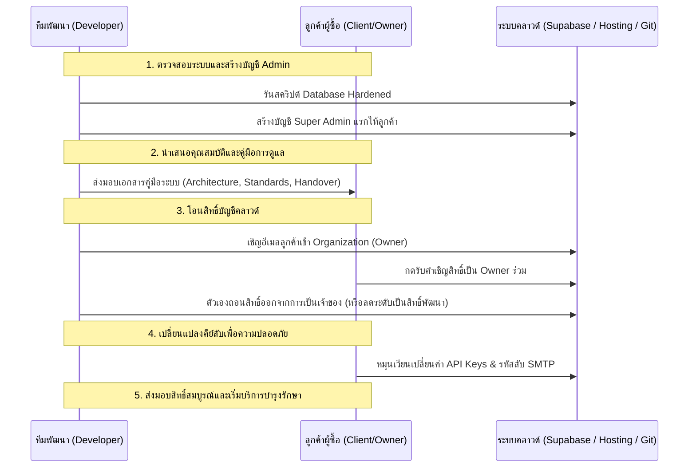

# 🚀 คู่มือการติดตั้งระบบและส่งมอบงานลูกค้า (Deployment, QA & Client Delivery Manual)

เอกสารนี้ทำหน้าที่เป็น **คู่มือส่งมอบงาน (Handoff Manual)** และคู่มือผู้ดูแลระบบสำหรับการติดตั้งโปรแกรม **Project Thunder Food** ตั้งแต่ขั้นตอนการนำเข้าระบบคลาวด์จริง (Production) การตรวจสอบความถูกต้องเชิงฟังก์ชัน (Quality Assurance) ไปจนถึงขั้นตอนการเปลี่ยนถ่ายความเป็นเจ้าของและการสำรองข้อมูลเพื่อความยั่งยืน

---

## 1. 🌐 การติดตั้งระบบฝั่งหน้าบ้าน (Frontend Deployment)

แอปพลิเคชัน Next.js 16 ได้รับการปรับแต่งให้พร้อมสำหรับการโฮสต์บนแพลตฟอร์มคลาวด์ชั้นนำ เช่น **Vercel** หรือ **Netlify** ซึ่งมีขั้นตอนการติดตั้งดังนี้:

### ขั้นตอนติดตั้งบน Vercel (ขั้นตอนแนะนำ):
1.  **เชื่อมโยง GitHub Repository:** 
    *   เข้าสู่ระบบ Vercel Dashboard จากนั้นกด **Add New > Project** 
    *   เลือก GitHub Account และคลิกเชื่อมต่อกับโปรเจค `Project Thunder Food`
2.  **ตั้งค่าโครงการ (Project Settings):**
    *   **Framework Preset:** Next.js (ระบบจะตรวจจับโดยอัตโนมัติ)
    *   **Root Directory:** `./` (โฟลเดอร์รากของโปรเจค)
3.  **กรอกข้อมูลตัวแปรสภาพแวดล้อม (Environment Variables):**
    *   กรอกค่าตัวแปรเหล่านี้ลงในส่วน *Environment Variables* ของ Vercel เพื่อใช้ในการเชื่อมต่อกับฐานข้อมูล Supabase สำหรับโปรดักชัน:
        *   `NEXT_PUBLIC_SUPABASE_URL` = *(URL ของ Supabase คัดลอกจากหน้าโครงการจริง)*
        *   `NEXT_PUBLIC_SUPABASE_ANON_KEY` = *(Anon Public API Key ของ Supabase)*
4.  **สั่งรันระบบ (Deploy):**
    *   กดปุ่ม **Deploy** ระบบจะเริ่มประมวลผล คอมไพล์โค้ดประเภท TypeScript และสร้างหน้าเว็บแบบ Static ให้อย่างมีประสิทธิภาพภายในเวลาไม่กี่นาที
    *   เมื่อเสร็จสิ้น คุณจะได้รับที่อยู่โดเมนใช้งานจริงของแอปพลิเคชัน (เช่น `https://thunder-food.vercel.app`)

---

## 2. ⚡ การตั้งค่าและสร้างระบบฐานข้อมูลบน Supabase Production

เพื่อป้องกันไม่ให้ข้อมูลการรันระบบทดสอบปะปนกับข้อมูลจริงของลูกค้า ให้สร้างโปรเจค Supabase ใหม่ขึ้นมาเฉพาะสำหรับใช้งานจริง (Production Project Instance) แล้วตั้งค่าความปลอดภัยตามลำดับดังนี้:

### 2.1 รันสร้างตารางข้อมูลและนโยบายความปลอดภัย (Database Schema & Migrations):
นำไฟล์ประวัติฐานข้อมูลจากในเครื่องของคุณอัปโหลดขึ้นไปยังฐานข้อมูลตัวใหม่ผ่านเครื่องมือ Supabase CLI:
```bash
# 1. เข้าสู่ระบบ Supabase
supabase login

# 2. เชื่อมต่อโปรเจคใช้งานจริง
supabase link --project-ref <รหัสโครงการโปรดักชันใหม่ของคุณ>

# 3. รันประวัติ SQL ทั้งหมดไปยังโครงการคลาวด์จริง
supabase db push
```
*(หมายเหตุ: หากไม่มีโปรแกรม Supabase CLI ในเครื่อง คุณสามารถเปิดไฟล์ในโฟลเดอร์ `supabase/migrations/` ในโปรเจคนี้ คัดลอกข้อความคำสั่ง SQL ทั้งหมดไปวางและรันในเมนู **SQL Editor** บนหน้าเว็บ Supabase Dashboard ตามลำดับของไฟล์เพื่อสร้างตาราง ดัชนี ตัวกระตุ้น RLS และฟังก์ชันความปลอดภัยทั้งหมดได้เช่นกัน)*

### 2.2 ตั้งค่าพื้นที่จัดเก็บสื่อและรูปภาพ (Supabase Storage Buckets Setup):
แอปพลิเคชันมีการอัปโหลดและดึงรูปโปรไฟล์ผู้ใช้งาน รวมถึงรูปอาหารของร้านค้า จึงต้องสร้างพื้นที่จัดเก็บรูปภาพในระบบ Supabase Storage ดังนี้:
1.  ไปที่เมนู **Storage** บนระบบควบคุมของ Supabase
2.  สร้าง Bucket ใหม่ขึ้นมา 2 ตัว ได้แก่:
    *   **`restaurant-images`** (สำหรับจัดเก็บรูปภาพโลโก้และรูปอาหารของร้านค้า)
    *   **`avatar-images`** (สำหรับจัดเก็บรูปโปรไฟล์ของผู้ใช้ ลูกค้า ไรเดอร์ และแอดมิน)
3.  **สำคัญมาก:** ต้องตั้งค่า Bucket ทั้งสองตัวให้เป็นประเภท **Public** เพื่อเปิดสิทธิ์การอ่านข้อมูลภาพสาธารณะ ทำให้เบราว์เซอร์สามารถดึงภาพไปแสดงบนหน้าเว็บได้ทันที

### 2.3 ตั้งค่าระบบการยืนยันตัวตนและอีเมล (Supabase Auth Hardening):
1.  **ตั้งค่า URL ปลายทาง (Redirect URLs):**
    *   ไปที่ **Authentication > URL Configuration** 
    *   ระบุที่อยู่ URL ของโดเมนจริงที่คุณติดตั้งหน้าบ้านไว้ (เช่น `https://thunder-food.vercel.app`) ในช่อง **Site URL** เพื่อให้ระบบล็อกอินและฟังก์ชันกู้คืนรหัสผ่านสามารถส่งลิงก์เปลี่ยนรหัสผ่านพาลูกค้ากลับมายังหน้าเว็บได้อย่างถูกต้อง
2.  **เชื่อมระบบส่งอีเมล (SMTP Server):**
    *   โดยเริ่มต้นระบบจะใช้อีเมลโควต้าจำกัดของ Supabase ในการยืนยันสมาชิกใหม่ (จำกัด 3 ฉบับต่อชั่วโมง) สำหรับใช้งานจริง ให้เปิดใช้งาน SMTP ของคุณเอง (เช่น ใช้บริการของ Resend, SendGrid, หรือ Google Workspaces) ในเมนู **Authentication > Email Templates** เพื่อให้การส่งจดหมายกู้รหัสผ่านมีความเสถียรและดูเป็นมืออาชีพ

---

## 3. 🧪 รายการตรวจสอบการทดสอบระบบก่อนส่งมอบ (Staging QA Checklist)

เพื่อให้มั่นใจว่าระบบทุกอย่างปราศจากความบกพร่องและทำงานได้อย่างถูกต้อง 100% ให้ทำตามขั้นตอนการทดสอบทีละบทบาทผู้ใช้ (Role-by-Role Test Suite) ดังนี้:

### 3.1 ด่านที่ 1: การลงทะเบียนและการล็อกอิน (Authentication & Entry Flow)
*   [ ] ทำการสมัครสมาชิกใหม่ในฐานะ **Customer** และ **Rider** ผ่านหน้าหน้าจอสมัครสมาชิก ปล่อยให้ระบบสร้างแถวข้อมูลโปรไฟล์ลงตาราง `public.users` และ `public.rider_profiles` อัตโนมัติ
*   [ ] ตรวจสอบว่าระบบสามารถเข้าสู่ระบบและนำทางผู้ใช้แต่ละคนไปยังแดชบอร์ดบทบาทที่ถูกต้อง (เช่น สมาชิกไรเดอร์ล็อกอินแล้วต้องเข้าหน้าไรเดอร์ทันที)
*   [ ] ทดสอบการป้องกันเส้นทางหน้าเว็บ (Middleware Protection) โดยทดลองนำบัญชีลูกค้าทั่วไป พิมพ์ URL เพื่อเข้าหน้า `/admin` หรือ `/restaurant` ระบบต้องทำการบล็อกและปัดผู้ใช้กลับมาหน้าแรกโดยอัตโนมัติ

### 3.2 ด่านที่ 2: ฝั่งลูกค้าสั่งซื้อสินค้า (Customer Ordering Flow)
*   [ ] เข้าหน้าโปรไฟล์ลูกค้าเพื่ออัปเดตข้อมูลส่วนตัว เบอร์โทรศัพท์ และพิกัดแผนที่จัดส่ง ตรวจสอบว่าข้อมูลในฐานข้อมูลอัปเดตจริง
*   [ ] เลือกร้านอาหารที่เปิดให้บริการ หยิบอาหารใส่ตะกร้าสินค้า ปรับจำนวนอาหาร และกดลบอาหารออก ตรวจสอบว่าราคาผลรวมอัปเดตตรงตามจริง
*   [ ] กดสั่งซื้อ (Checkout) และระบุที่อยู่พร้อมการเลือกวิธีชำระเงิน ตรวจสอบว่าคำสั่งซื้อสร้างสำเร็จในสถานะ `pending`

### 3.3 ด่านที่ 3: เจ้าของร้านอาหารรับออเดอร์ (Restaurant Operations Flow)
*   [ ] ล็อกอินบัญชีร้านอาหารเพื่ออัปเดตข้อมูลร้านค้า พิกัดร้าน ปรับสถานะร้านให้เปิดบริการ (`is_open = true`)
*   [ ] ทดลองสร้างหมวดหมู่อาหาร เพิ่มรายการเมนูใหม่ อัปโหลดรูปภาพอาหาร และสลับปุ่มความพร้อมให้บริการของเมนูนั้นๆ
*   [ ] ตรวจสอบว่ามีคำสั่งซื้อใหม่จากลูกค้าแสดงขึ้นมาบนหน้าแดชบอร์ดร้านแบบ Real-time โดยไม่ต้องรีเฟรชหน้าเว็บ
*   [ ] เจ้าของร้านอาหารกดยอมรับคำสั่งซื้อและก้าวสถานะ: `pending` ➡️ `preparing` ➡️ `ready` (ปรุงเสร็จพร้อมส่ง)

### 3.4 ด่านที่ 4: ไรเดอร์รับงานและขนส่ง (Rider Delivery Flow)
*   [ ] ไรเดอร์เข้าสู่หน้างาน กดปุ่มเปิดระบบออนไลน์ทำงาน ตรวจสอบว่าสลับสถานะออนไลน์บนฐานข้อมูลจริง
*   [ ] ตรวจสอบประวัติงานที่ปรุงเสร็จ (`ready`) ในละแวกใกล้เคียง แสดงขึ้นมาให้กดรับงาน
*   [ ] ไรเดอร์กดยอมรับงาน ตรวจสอบว่าสถานะคำสั่งซื้อเปลี่ยนพ่วงไอดีของไรเดอร์เข้าระบบ และแอปพลิเคชันลูกค้าแสดงข้อมูลไรเดอร์ทันที
*   [ ] ไรเดอร์เดินทางไปรับอาหาร กดยืนยันการรับ และนำอาหารไปส่งถึงหน้าบ้านลูกค้าสำเร็จแล้วกดเสร็จสิ้นงาน (`completed`)
*   [ ] ตรวจสอบรายได้สะสมของไรเดอร์ (Total Earnings) ว่าคำนวณบวกค่าจัดส่งของรอบงานดังกล่าวอย่างถูกต้อง

### 3.5 ด่านที่ 5: แอดมินตรวจสอบข้อมูลระบบส่วนกลาง (Admin Central Management Flow)
*   [ ] ล็อกอินบัญชีแอดมิน ตรวจสอบการโหลดตัวเลขสรุปยอดภาพรวมบนแดชบอร์ด (จำนวนร้านค้า, ยอดขายทั้งหมด, ยอดสมาชิก)
*   [ ] เข้าตรวจสอบตารางคำสั่งซื้อและร้านค้าทั้งหมด เพื่อความเรียบร้อยของระบบฐานข้อมูล

---

## 4. 🤝 ขั้นตอนสากลการโอนย้ายระบบและส่งมอบงานแก่ลูกค้า (Handoff Checklist)

การส่งมอบงานระดับมืออาชีพอย่างสมบูรณ์แบบ ต้องมีการถ่ายโอนความเป็นเจ้าของของระบบคลาวด์และจัดการสิทธิ์การเข้าถึงอย่างเป็นทางการเพื่อความปลอดภัย:



### รายการปฏิบัติการส่งมอบงาน (SOP Handoff Checklist):
1.  **การโอนสิทธิ์บัญชี Supabase Organization:**
    *   ให้ลูกค้าเปิดบัญชีผู้ใช้ Supabase ของตนเอง
    *   ทีมพัฒนาเข้าไปที่โปรเจค Supabase หลัก ไปที่เมนู **Org Settings > Members**
    *   กด **Invite Member** กรอกอีเมลลูกค้าและเลือกบทบาทเป็น **Owner**
    *   เมื่อลูกค้ายอมรับการเชิญแล้ว ทีมพัฒนาสามารถกดออกจาก Organization หรือขอลดระดับตำแหน่งเป็นทีมพัฒนาเสริม เพื่อให้ลูกค้ามีสิทธิ์ขาดสูงสุดในโครงการและข้อมูลผู้ใช้ทั้งหมด
2.  **การโอนสิทธิ์หน้าเว็บโฮสติ้ง (Vercel / Netlify):**
    *   ไปที่เมนู **Settings > Members** บนบัญชีโครงการหน้าบ้าน
    *   เชิญอีเมลของลูกค้าเข้ามารับบทบาทเป็น Owner หรือผู้ดูแลหลักของทีม
    *   ทำการเชื่อมต่อชื่อโดเมนเว็บจดทะเบียนส่วนตัวของลูกค้า (Custom Domain) เพื่อความเรียบร้อย
3.  **การถ่ายโอนสิทธิ์ซอร์สโค้ด (GitHub Repository):**
    *   ไปที่หน้าตั้งค่าของโครงการบน GitHub ไปที่ **Settings > Collaborators**
    *   กดปุ่มเชิญไอดี GitHub ของลูกค้ามารับบทบาทเป็น Admin ร่วม หรือกด **Transfer Ownership** ย้ายไปอยู่ใน GitHub Organization ของตัวลูกค้าโดยตรงเพื่อความเหมาะสม
4.  **ความปลอดภัยและการหมุนเวียนคีย์ความลับ (Secret Keys Rotation):**
    *   เมื่อโอนย้ายความเป็นเจ้าของเรียบร้อย แนะนำให้ลูกค้าและผู้พัฒนาช่วยกันกด **Rotate API Keys** (สร้างคีย์ API ใหม่) ทั้งใน Supabase และกู้รหัสผ่าน SMTP เพื่อตัดสิทธิ์การจำของคีย์ชุดเก่าที่อาจรั่วไหลระหว่างการพัฒนาระบบ
5.  **ระบบการสำรองข้อมูล PostgreSQL อัตโนมัติ (Automated Backups):**
    *   สำหรับลูกค้าแอปพลิเคชัน ให้แนะนำให้ใช้แพ็กเกจมาตรฐานของ Supabase เพื่อเปิดระบบสำรองข้อมูลฐานข้อมูลรายวัน (Daily Database Backups) แบบอัตโนมัติ ช่วยป้องกันการสูญหายของประวัติข้อมูลร้านค้าและรายได้ของลูกค้าทั้งหมด
    *   ตั้งข้อกำหนดเรื่องเวลาและช่องทางการแจ้งเตือนเมื่อระบบมีปัญหา (Status Monitoring)

---

คู่มือติดตั้งระบบและส่งมอบฉบับนี้ จะสร้างความอุ่นใจและเพิ่มความคุ้มค่าให้แก่ลูกค้าอย่างสูงสุด สะท้อนถึงการทำงานที่มีระบบระเบียบตามมาตรฐานวิศวกรรมซอฟต์แวร์สากล!
