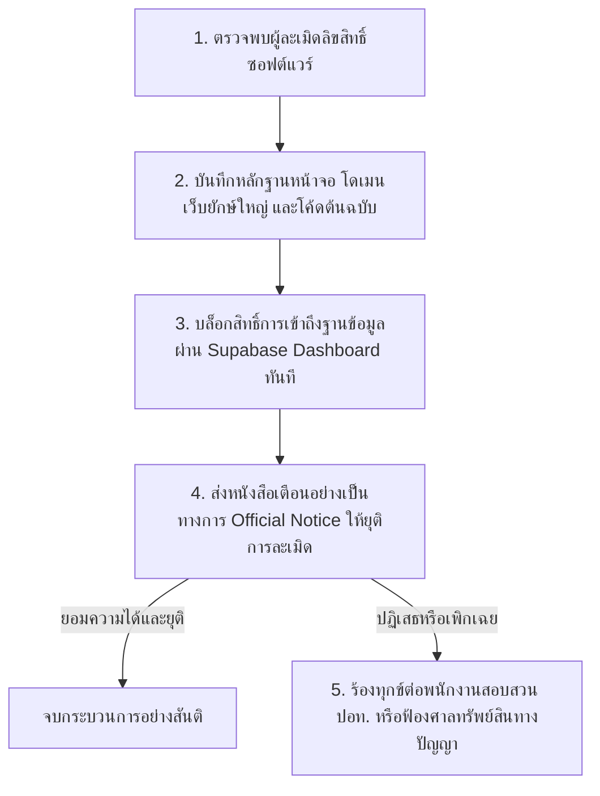

# ⚖️ ข้อกำหนดกฎหมาย การคุ้มครองลิขสิทธิ์ และความปลอดภัยข้อมูล (Legal Terms, Copyright & Data Protection Guide)

**จัดทำขึ้นเป็นพิเศษเพื่อคุ้มครองและพิทักษ์สิทธิ์ทางกฎหมายของ: ARMUXUI**
**เอกสารฉบับนี้กำหนดมาตรการทางกฎหมายเพื่อปกป้องสิทธิ์เด็ดขาดในฐานะผู้สร้างสรรค์ซอฟต์แวร์ระบบ Project Thunder Food**

---

## 1. 🛡️ ข้อมูลทางกฎหมายและการแสดงสิทธิ์ความเป็นเจ้าของ (Statement of Ownership & Legal Standing)

แอปพลิเคชันระบบ **Project Thunder Food** ทั้งหมด รวมถึงแต่ไม่จำกัดเพียง ซอร์สโค้ด (TypeScript, SQL, Tailwind CSS), การออกแบบส่วนติดต่อผู้ใช้ (UI Layouts), องค์ประกอบเชิงทัศน์ (Visual Assets), สถาปัตยกรรมสคีมาฐานข้อมูล (Database Schema) และตรรกะประมวลผลฝั่งเซิร์ฟเวอร์ (Server-Side Logic) ได้รับการสร้างสรรค์ขึ้นโดย **ARMUXUI** และมีสถานะเป็นทรัพย์สินทางปัญญาที่ได้รับความคุ้มครองทางกฎหมายทันทีนับแต่วันที่สร้างสรรค์ขึ้นโดยไม่ต้องจดทะเบียน

### กฎหมายคุ้มครองหลักที่นำมาใช้บังคับทางกฎหมาย:
1.  **พระราชบัญญัติลิขสิทธิ์ พ.ศ. 2537 (และฉบับปรับปรุงเพิ่มเติม):**
    *   งานซอฟต์แวร์นี้จัดเป็น **"งานวรรณกรรม"** ประเภทโปรแกรมคอมพิวเตอร์ตามมาตรา 4 ของ พ.ร.บ. ลิขสิทธิ์ 
    *   **ARMUXUI** มีสิทธิ์แต่เพียงผู้เดียว (Exclusive Rights) ในการทำซ้ำ ดัดแปลง เผยแพร่ต่อสาธารณชน หรือให้เช่าโปรแกรมคอมพิวเตอร์นี้ ตามมาตรา 15 
    *   การทำซ้ำ ดัดแปลง หรือเผยแพร่ซอร์สโค้ด UI หรือฐานข้อมูลของระบบนี้โดยไม่ได้รับความยินยอมเป็นลายลักษณ์อักษรจาก **ARMUXUI** ถือเป็นการ **"ละเมิดลิขสิทธิ์โดยตรง"** มีความผิดทางอาญาและต้องชดใช้ค่าเสียหายทางแพ่ง
2.  **พระราชบัญญัติว่าด้วยการกระทำความผิดเกี่ยวกับคอมพิวเตอร์ พ.ศ. 2550 (และฉบับปรับปรุง พ.ศ. 2560):**
    *   การเข้าถึงส่วนหนึ่งส่วนใดของซอร์สโค้ด โฮสติ้งเซิร์ฟเวอร์ หรือฐานข้อมูล Supabase โดยไม่ได้รับอนุญาต หรือการดาวน์โหลดซอร์สโค้ดของระบบออกไปใช้งาน ถือเป็นความผิดฐานเข้าถึงระบบคอมพิวเตอร์และข้อมูลคอมพิวเตอร์ที่มีมาตรการป้องกันโดยมิชอบ (มาตรา 5 และ มาตรา 7) มีโทษจำคุกและปรับเงิน
3.  **ประมวลกฎหมายแพ่งและพาณิชย์ (มาตรา 420 เรื่องละเมิด):**
    *   หากการกระทำละเมิดก่อให้เกิดความเสียหายทางการเงิน เสียโอกาสทางธุรกิจ หรือเสื่อมเสียชื่อเสียงแก่ **ARMUXUI** ทางเจ้าของสิทธิ์สามารถฟ้องร้องดำเนินคดีเพื่อเรียกร้องค่าสินไหมทดแทนได้อย่างเต็มจำนวน

---

## 🚫 2. การกระทำที่ถือเป็นการละเมิดเงื่อนไขและมาตรการเอาผิด (Breach of Conditions & Infringements)

เพื่อปกป้องระบบของคุณให้ปลอดภัยจากผู้ประสงค์ร้ายและคู่แข่งทางธุรกิจ **ARMUXUI** มีสิทธิ์เด็ดขาดในการดำเนินคดีทางกฎหมายทันทีหากตรวจพบการกระทำดังต่อไปนี้:

### 2.1 การคัดลอกหรือดัดแปลงระบบ (Unauthorized Duplication & Modification)
*   **การกระทำผิด:** การดาวน์โหลด คัดลอกซอร์สโค้ด ถอดแบบ UI หน้าต่างแอปพลิเคชัน หรือนำโครงสร้าง SQL ในระบบไปใช้สร้างแอปพลิเคชันใหม่เพื่อผลประโยชน์ส่วนตัวหรือเชิงพาณิชย์โดยไม่ได้รับความยินยอม
*   **ผลทางกฎหมาย:** ถือเป็นการละเมิดลิขสิทธิ์ตาม พ.ร.บ. ลิขสิทธิ์ มาตรา 27 และมาตรา 30 **ARMUXUI** สามารถฟ้องศาลทรัพย์สินทางปัญญาและการค้าระหว่างประเทศเพื่อขอยุติการกระทำดังกล่าวทันที (คำสั่งคุ้มครองชั่วคราว) และฟ้องเรียกค่าเสียหายทางแพ่งได้ตามจริง พร้อมทั้งร้องทุกข์ต่อพนักงานสอบสวนเพื่อดำเนินคดีอาญาที่มีโทษจำคุกสูงสุดถึง 4 ปี หรือปรับสูงสุด 800,000 บาท หรือทั้งจำทั้งปรับ (กรณีการทำเพื่อการค้า)

### 2.2 การทำวิศวกรรมย้อนกลับและพยายามเจาะระบบ (Reverse Engineering & Intrusions)
*   **การกระทำผิด:** การพยายามดีคอมไพล์โค้ดฝั่ง Client ของ Next.js, การใช้เครื่องมือดักฟัง API Calls เพื่อแกะตรรกะระบบ, หรือการทดลองแฮกข้ามสิทธิ์ RLS ของ Supabase
*   **ผลทางกฎหมาย:** นอกเหนือจากการละเมิดลิขสิทธิ์แล้ว การกระทำนี้ถือเป็นความผิดอาญาแผ่นดินตาม พ.ร.บ. คอมพิวเตอร์ ทันที มีโทษจำคุกสูงสุด 2 ปี หรือปรับไม่เกิน 40,000 บาท หรือทั้งจำทั้งปรับ และ **ARMUXUI** จะทำการระงับบัญชีผู้ใช้และบล็อก IP Address ดังกล่าวอย่างถาวร

### 2.3 การดึงข้อมูลโดยมิชอบและการสแปมเซิร์ฟเวอร์ (Illegal Scraping & Abuse)
*   **การกระทำผิด:** การใช้โปรแกรมบอท (Bots) หรือสคริปต์อัตโนมัติในการดึงข้อมูล (Scrape) รายชื่อร้านค้า เมนูอาหาร หรือราคาจากแอปพลิเคชันไปใช้ประโยชน์ส่วนตัว หรือการจงใจสแปมยิงออเดอร์ปลอม (DDoS / Fake Orders) เพื่อสร้างความเสียหายแก่ร้านอาหารคู่สัญญา
*   **ผลทางกฎหมาย:** เป็นความผิดฐานทำให้เสียหาย ทำลาย แก้ไข หรือรบกวนการทำงานของระบบคอมพิวเตอร์ผู้อื่น (พ.ร.บ. คอมพิวเตอร์ มาตรา 10) มีโทษจำคุกสูงสุด 5 ปี หรือปรับไม่เกิน 100,000 บาท หรือทั้งจำทั้งปรับ

---

## 🔒 3. นโยบายคุ้มครองข้อมูลส่วนบุคคลและการปฏิบัติตาม PDPA (Data Protection & PDPA Compliance)

เมื่อนำระบบออกไปเผยแพร่ใช้งานจริง แอปพลิเคชันนี้ต้องอยู่ภายใต้บังคับของ **พระราชบัญญัติคุ้มครองข้อมูลส่วนบุคคล พ.ศ. 2562 (PDPA)** เพื่อปกป้องทั้งผู้ใช้และเพื่อคุ้มครองความรับผิดชอบทางกฎหมายของ **ARMUXUI** ในฐานะเจ้าของระบบ:

1.  **การจัดเก็บข้อมูลอย่างปลอดภัย (Secure Storage on Supabase):**
    *   ข้อมูลส่วนบุคคลทั้งหมด (อีเมล, รหัสผ่าน, เบอร์โทรศัพท์, ละติจูด/ลองจิจูดที่อยู่จัดส่ง) ได้รับการเข้ารหัสความปลอดภัยระดับมาตรฐานสากลตั้งแต่ฝั่งฐานข้อมูล 
    *   รหัสผ่านได้รับการปกป้องด้วยฟังก์ชันแฮช (Cryptographic Hash) บนบริการของ Supabase Auth ไม่สามารถกู้กลับเป็นรหัสธรรมดาได้ ป้องกันการรั่วไหล 100%
2.  **การควบคุมความยินยอม (Consent & Privacy Notice):**
    *   ในการสมัครใช้งานครั้งแรก ระบบต้องกำหนดให้ผู้ใช้ยอมรับ *นโยบายความเป็นส่วนตัว (Privacy Policy)* เพื่อให้ความยินยอมแก่แพลตฟอร์มในการจัดเก็บพิกัด GPS สำหรับใช้ในการส่งอาหาร
3.  **การจำกัดการเปิดเผยข้อมูล (Data Minimization):**
    *   สถาปัตยกรรม RLS (Row-Level Security) ที่ออกแบบไว้ จะทำหน้าที่ล็อกข้อมูลให้เข้าถึงได้เฉพาะผู้มีส่วนเกี่ยวข้องโดยตรงตามบทบาทเท่านั้น (เช่น ไรเดอร์จะเห็นเบอร์โทรศัพท์และที่อยู่เฉพาะในออเดอร์ที่ตนเองรับงานเท่านั้น เมื่อจบงานสิทธิ์จะถูกปิดทันที) ซึ่งสอดคล้องอย่างสมบูรณ์แบบกับมาตรา 21 ของ PDPA เรื่องการจำกัดวัตถุประสงค์การใช้ข้อมูล

---

## 🚫 4. ข้อจำกัดความรับผิดชอบทางกฎหมายของเจ้าของระบบ (Disclaimers & Limitations of Liability)

เพื่อป้องกันไม่ให้ผู้ใช้ปลายทางหรือร้านค้าคู่สัญญาฟ้องร้องดำเนินคดีเรียกค่าเสียหายจาก **ARMUXUI** ในกรณีที่เกิดปัญหาภายนอกที่อยู่นอกเหนือการควบคุม เอกสารนี้ได้กำหนด **ข้อความปฏิเสธความรับผิดชอบ (Legal Disclaimer)** ที่มีผลบังคับใช้อย่างสมบูรณ์:

*   **ปัญหาคุณภาพอาหารและบริการจัดส่ง:** **ARMUXUI** ในฐานะผู้จัดเตรียมแพลตฟอร์มเทคโนโลยีซอฟต์แวร์ จะไม่รับผิดชอบทางกฎหมายใดๆ ต่อข้อพิพาทด้านคุณภาพอาหาร สุขอนามัย การจัดส่งที่ล่าช้า ความเสียหายของกล่องอาหาร หรือพฤติกรรมที่ไม่เหมาะสมของไรเดอร์และลูกค้าคู่สัญญา
*   **ระบบขัดข้องทางเทคนิค (Technical Downtime):** **ARMUXUI** จะไม่รับผิดชอบต่อความสูญเสียทางการเงินหรือโอกาสทางธุรกิจของร้านค้าและลูกค้า ในกรณีที่แอปพลิเคชันหรือระบบฐานข้อมูล Supabase เกิดการขัดข้องทางเทคนิค หรือสัญญาณเซิร์ฟเวอร์คลาวด์ดับชั่วคราว (Hosting Outages)
*   **ธุรกรรมทางการเงินล้มเหลว:** ข้อผิดพลาดทางธุรกรรมโอนเงินหรือการสแกนจ่ายที่ไม่สมบูรณ์ระหว่างผู้ใช้และร้านค้า จัดเป็นความรับผิดชอบร่วมกันระหว่างธนาคารผู้ให้บริการและผู้ใช้บริการโดยตรง ไม่เกี่ยวข้องกับสิทธิ์ความรับผิดชอบของซอฟต์แวร์นี้

---

## ⚖️ 5. สรุปแนวทางปฏิบัติสำหรับ ARMUXUI ในการดำเนินคดีผู้ละเมิด

หากคุณพบเห็นบุคคลภายนอกนำซอร์สโค้ด รูปแบบดีไซน์ หรือระบบฐานข้อมูลนี้ไปใช้งานโดยไม่ได้รับอนุญาต ให้ทำตามขั้นตอนการปกป้องตนเองดังนี้:

1.  **รวบรวมหลักฐานดิจิทัล:** บันทึกหลักฐาน URLs, ภาพถ่ายหน้าจอการทำงานของระบบฝั่งผู้ละเมิด, และตรวจสอบประวัติล็อกการเข้าถึงในฐานข้อมูล (Supabase Audit Logs) เพื่อระบุไอดีหรือ IP ที่อาจเป็นจุดรั่วไหล
2.  **ระงับสิทธิ์ทันที:** ทำการบล็อกการเชื่อมต่อ API ของโดเมนผู้ละเมิดผ่านเมนูการตั้งค่าความปลอดภัยของ Supabase 
3.  **แจ้งเตือนอย่างเป็นทางการ (Cease and Desist Letter):** ส่งจดหมายแจ้งเตือนทางกฎหมายอย่างเป็นทางการโดยระบุความเป็นเจ้าสิทธิ์ของ **ARMUXUI** และสั่งให้ยุติการเผยแพร่ระบบที่ละเมิดภายในเวลาที่กำหนด
4.  **ฟ้องร้องดำเนินคดีศาล:** หากผู้ละเมิดเพิกเฉย ให้แต่งตั้งทนายความเพื่อยื่นฟ้องต่อศาลทรัพย์สินทางปัญญาและการค้าระหว่างประเทศกลางในการดำเนินคดีเรียกร้องค่าเสียหายขั้นสูงสุดทันที

---

**เอกสารกฎหมายและการคุ้มครองข้อมูลฉบับนี้ ได้รับการจัดทำขึ้นด้วยมาตรฐานสูงสุดเพื่อมอบเกราะป้องกันและอำนาจทางกฎหมายที่เด็ดขาดแก่ ARMUXUI ในการควบคุม ปกป้อง และสร้างมูลค่าให้แก่ลิขสิทธิ์ซอฟต์แวร์ Project Thunder Food สืบไป!**
