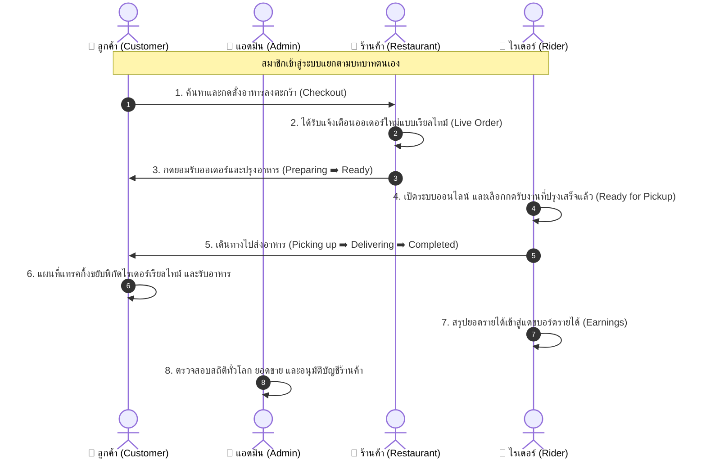
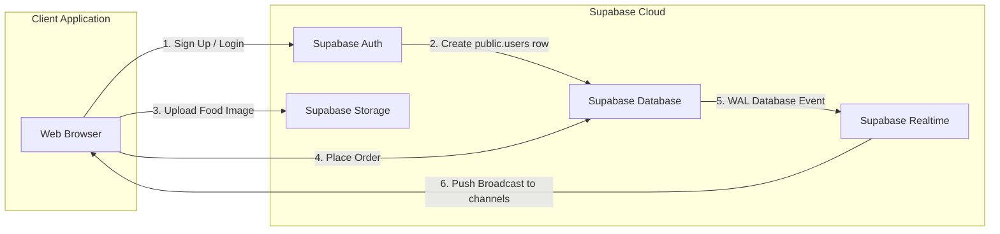

# 📘 คู่มืออธิบายระบบแอปพลิเคชันอย่างเป็นทางการ (Official Application Explanation Guide)

ยินดีต้อนรับสู่คู่มืออธิบายระบบอย่างเป็นทางการสำหรับ **Project Thunder Food (โปรเจค ธันเดอร์ ฟู้ด)** แอปพลิเคชันนี้ถูกออกแบบและพัฒนาขึ้นเป็นแพลตฟอร์มสั่งและจัดส่งอาหารออนไลน์ (SaaS Multi-Role Food Delivery Platform) ประสิทธิภาพสูง ทำงานร่วมกันแบบเรียลไทม์อย่างสมบูรณ์แบบ 

เอกสารนี้จะอธิบายรายละเอียดคุณสมบัติ ฟังก์ชันการทำงาน ขั้นตอนการไหลเวียนข้อมูล (Workflows) โครงสร้างหน้าเว็บทั้งหมดในระบบ และระบบการเชื่อมต่อคลาวด์เบื้องหลังอย่างละเอียด

---

## 1. 🌟 ภาพรวมแอปพลิเคชัน (Application Overview)

**Project Thunder Food** นำเสนอโซลูชันระบบจัดส่งอาหารระดับพรีเมียม ที่เชื่อมโยงผู้เกี่ยวข้องทั้งหมดไว้ในแพลตฟอร์มเดียว ขับเคลื่อนด้วยขุมพลังเทคโนโลยีเว็บยุคใหม่:
*   **Next.js 16 (App Router)** และ **React 19** มอบความเร็วในการประมวลผลและการสลับหน้าเว็บอย่างไร้รอยต่อ
*   **Supabase (PostgreSQL Database)** ทำหน้าที่ควบคุมฐานข้อมูล ประมวลผลแบบเรียลไทม์ และระบบยืนยันตัวตน
*   **Tailwind CSS & Shadcn UI** ส่งมอบดีไซน์แบบ Glassmorphism หรูหราทันสมัย พร้อมรองรับหน้าจอมือถือ (Responsive Mobile-First)

---

## 👥 2. บทบาทผู้ใช้งานและขั้นตอนการทำงานเชิงฟังก์ชัน (Detailed User Workflows)

ระบบแยกสิทธิ์การใช้งานออกเป็น 4 บทบาทหลักอย่างชัดเจน โดยมีลำดับขั้นตอนการทำงานเชื่อมโยงกันอย่างเป็นระบบ:

### 2.1 🛒 ฝั่งลูกค้า (Customer Flow)
1.  **การยืนยันที่อยู่และโปรไฟล์:** ลูกค้าเข้าหน้าโปรไฟล์เพื่อกรองที่อยู่อย่างละเอียดและระบุพิกัด GPS เพื่อนำไปคำนวณระยะทางจัดส่งจริง
2.  **การเลือกดูร้านอาหาร:** ลูกค้าเลือกดูร้านอาหารที่เปิดให้บริการในระบบ สามารถเลือกอ่านรายละเอียด เมนู และคะแนนรีวิวร้านค้าได้
3.  **การเลือกรายการอาหารและสั่งซื้อ:**
    *   ลูกค้าสามารถเลือกอาหารเพิ่มลงตะกร้า โดยตะกร้าสินค้าจะคำนวณราคารวมและค่าจัดส่งโดยอัตโนมัติ
    *   หน้าดำเนินการสั่งซื้อ (Checkout) ลูกค้าสามารถเลือกวิธีการชำระเงินได้ 2 แบบ คือ *เงินสดปลายทาง (Cash)* หรือ *โอนเงินผ่านระบบธนาคาร (Transfer)*
4.  **ระบบติดตามเรียลไทม์ (Real-time Order Tracking):** หลังกดสั่งซื้อ ลูกค้าจะถูกนำมายังหน้ารายละเอียดคำสั่งซื้อ ซึ่งจะแสดงแผงสถานะเรียลไทม์ของออเดอร์นั้นๆ และแสดงตำแหน่งการนำทางของไรเดอร์ที่วิ่งมารับอาหารบนแผนที่สดๆ

### 2.2 🍳 ฝั่งเจ้าของร้านอาหาร (Restaurant Owner Flow)
1.  **หน้าข้อมูลร้านค้า (Restaurant Profile):** เจ้าของร้านจัดการรายละเอียดชื่อร้าน รูปภาพหน้าปก พิกัด GPS สำหรับให้แผนที่ลูกค้าค้นหา และปุ่มเปิด-ปิดร้านค้า
2.  **ระบบจัดการหมวดหมู่และเมนูอาหาร (Interactive Menu Manager):**
    *   เจ้าของร้านสามารถสร้างหมวดหมู่อาหาร (เช่น อาหารจานเดียว, เครื่องดื่ม, ของหวาน) และจัดเรียงลำดับได้
    *   สามารถเพิ่มเมนูอาหาร ตั้งราคา ใส่รูปภาพประกอบ และสลับปุ่มเปิด-ปิดความพร้อมให้บริการของเมนู (เช่น กรณีวัตถุดิบหมด)
3.  **แผงควบคุมคำสั่งซื้อเข้าสด (Live Order Dashboard):** หน้าจอรับออเดอร์แบบเรียลไทม์ เมื่อลูกค้าสั่งซื้อ ออเดอร์จะแสดงขึ้นมาพร้อมเสียงแจ้งเตือน ร้านค้าสามารถกดเปลี่ยนสถานะได้ 3 ลำดับ:
    *   `pending` (รอยืนยัน) ➡️ `preparing` (กำลังปรุงอาหาร) ➡️ `ready` (ปรุงเสร็จสิ้น พร้อมจัดส่ง)
4.  **สรุปรายงานรายได้ (Revenue History):** แดชบอร์ดวิเคราะห์ยอดขายรวม สรุปกราฟรายได้รายวันและรายเดือน และประวัติออเดอร์ที่ผ่านมาทั้งหมด

### 2.3 🛵 ฝั่งไรเดอร์ส่งอาหาร (Rider Flow)
1.  **ประวัติและรายละเอียดไรเดอร์:** ไรเดอร์กรอกข้อมูลรถยนต์/มอเตอร์ไซค์ เลขทะเบียน และเลขบัญชีธนาคารสำหรับถอนรายได้
2.  **การเปิดสถานะพร้อมรับงาน (Online Toggle):** หน้าจอหลักมีปุ่มกดเปิด-ปิดการทำงานออนไลน์ เพื่อความยืดหยุ่นในการรับงาน
3.  **กระดานรับงาน (Job Board):** เมื่อร้านอาหารเปลี่ยนออเดอร์เป็นปรุงเสร็จ (`ready`) ออเดอร์จะมาปรากฏบนกระดานงานของไรเดอร์ในพื้นที่ ไรเดอร์สามารถอ่านรายละเอียดและกดยอมรับงาน
4.  **หน้านำทางขนส่ง (Active Delivery Map):** เมื่อกดรับงาน ระบบจะแสดงแผนที่นำทางนำไรเดอร์ไปยังร้านอาหารเพื่อรับกล่องอาหาร ➡️ และนำทางจากร้านอาหารไปยังบ้านของลูกค้า ไรเดอร์กดก้าวสถานะ:
    *   `picking_up` (กำลังไปรับอาหาร) ➡️ `delivering` (กำลังจัดส่ง) ➡️ `completed` (ส่งถึงมือลูกค้าเรียบร้อย)
5.  **แดชบอร์ดรายได้ (Earnings Tracking):** แสดงรายละเอียดประวัติงานจัดส่ง และรายได้สะสมทั้งหมด (Total Earnings) ที่ถอนเข้าธนาคารได้

### 2.4 🔑 ฝั่งผู้ดูแลระบบส่วนกลาง (System Admin Flow)
1.  **แดชบอร์ดสถิติภาพรวม (Admin Dashboard):** หน้าแดชบอร์ดของแอดมินแสดงสรุปตัวเลขสถิติยอดคำสั่งซื้อรวม รายได้สุทธิ จำนวนสมาชิก ลูกค้า ไรเดอร์ และร้านอาหารทั้งหมดในระบบ
2.  **การยืนยันความถูกต้องของร้านค้า (Restaurant Verification):** แอดมินมีสิทธิ์เข้าไปตรวจสอบรายละเอียดร้านค้าและข้อมูลพาร์ทเนอร์ และมีอำนาจในการระงับสิทธิ์หรือยืนยันร้านค้าใหม่เข้าร่วมแพลตฟอร์ม
3.  **การจัดการผู้ใช้งานและการตั้งค่า (System Control):** แอดมินสามารถเปิดดูข้อมูลบัญชี ค้นหา และปรับปรุงสถานะ RLS ความปลอดภัย รวมถึงค่ากำหนดพื้นฐานของระบบจัดส่งทั้งหมด

---

## 📁 3. ดัชนีหน้าเว็บและโครงสร้างเส้นทางระบบ (Comprehensive Route & Page Index)

เพื่อให้ทีมงานเข้าใจถึงพิกัดของไฟล์ทุกหน้าในระบบ Next.js App Router ตารางด้านล่างนี้ได้รวบรวมเส้นทาง URL และหน้าที่ของไฟล์ไว้อย่างครบถ้วน:

### 3.1 หน้าระบบทั่วไป (General & Authentication Routes)
| ที่อยู่ URL | ไฟล์ต้นฉบับในโปรเจค | บทบาทและรายละเอียดการทำงาน |
| :--- | :--- | :--- |
| `/` | `app/page.tsx` | หน้าแรกต้อนรับของระบบ (Home Landing Page) |
| `/login` | `app/login/page.tsx` | หน้าจอลงทะเบียนเข้าสู่ระบบ แยกตามระดับบัญชี |
| `/register` | `app/register/page.tsx` | หน้าจอสมัครสมาชิกใหม่ (ระบุชื่อ, เบอร์โทร และ Role) |
| `/forgot-password` | `app/forgot-password/page.tsx` | หน้าจอยืนยันอีเมลเพื่อกู้คืนรหัสผ่านสมาชิก |
| `/profile` | `app/profile/page.tsx` | หน้าข้อมูลโปรไฟล์ภาพรวมส่วนตัวของผู้ใช้งาน |
| `/profile/addresses` | `app/profile/addresses/page.tsx` | หน้าจัดการที่อยู่อย่างละเอียดและแผนที่พิกัดบ้านลูกค้า |

### 3.2 หน้าระบบลูกค้า (Customer Routes)
| ที่อยู่ URL | ไฟล์ต้นฉบับในโปรเจค | บทบาทและรายละเอียดการทำงาน |
| :--- | :--- | :--- |
| `/customer` | `app/customer/page.tsx` | หน้าหลักลูกค้าสำหรับ ค้นหาและดูรายชื่อร้านอาหารรอบตัว |
| `/customer/restaurant/[id]`| `app/customer/restaurant/[id]/page.tsx` | หน้าแสดงรายละเอียดเมนูอาหารทั้งหมดของร้านค้าแต่ละร้าน |
| `/checkout` | `app/checkout/page.tsx` | หน้าจอคำนวณเงิน ตรวจค่าส่ง และกดสั่งซื้ออาหาร |
| `/orders` | `app/orders/page.tsx` | หน้าประวัติการสั่งซื้อทั้งหมด และตัวรับข่าวสารเรียลไทม์ออเดอร์ |

### 3.3 หน้าระบบเจ้าของร้านค้า (Restaurant Owner Routes)
| ที่อยู่ URL | ไฟล์ต้นฉบับในโปรเจค | บทบาทและรายละเอียดการทำงาน |
| :--- | :--- | :--- |
| `/restaurant` | `app/restaurant/page.tsx` | หน้าแรกแผงสถิติรวมของร้านค้า และสลับปุ่ม เปิด-ปิด ร้านค้า |
| `/restaurant/orders` | `app/restaurant/orders/page.tsx` | หน้าแผงออเดอร์เข้าสดแบบเรียลไทม์ และปุ่มปรุงอาหารสำเร็จ |
| `/restaurant/menu` | `app/restaurant/menu/page.tsx` | หน้าผู้จัดการเมนูอาหาร (Menu Manager) และหมวดหมู่ |
| `/restaurant/history` | `app/restaurant/history/page.tsx` | หน้าแสดงประวัติคำสั่งซื้อทั้งหมดที่จบงานแล้วของร้าน |
| `/restaurant/profile` | `app/restaurant/profile/page.tsx` | หน้าแก้ไขโปรไฟล์ร้านค้า อัปรูปหน้าร้าน พิกัด และรายละเอียด |
| `/restaurant/reviews` | `app/restaurant/reviews/page.tsx` | แผงดูและตรวจสอบข้อความรีวิว/คะแนนจากลูกค้าทั้งหมด |
| `/restaurant/notifications`| `app/restaurant/notifications/page.tsx`| แผงแจ้งเตือนการสั่งซื้อหรือข้อมูลประกาศพิเศษ |
| `/restaurant/settings` | `app/restaurant/settings/page.tsx` | หน้าตั้งค่าแอปพลิเคชันของร้านค้า |
| `/restaurant/help` | `app/restaurant/help/page.tsx` | ศูนย์ช่วยเหลือเจ้าของร้านค้าและติดต่อแอดมิน |

### 3.4 หน้าระบบไรเดอร์ส่งอาหาร (Rider Routes)
| ที่อยู่ URL | ไฟล์ต้นฉบับในโปรเจค | บทบาทและรายละเอียดการทำงาน |
| :--- | :--- | :--- |
| `/rider` | `app/rider/page.tsx` | หน้าแรกไรเดอร์สำหรับสลับออนไลน์และดูประวัติงานเด่น |
| `/rider/active` | `app/rider/active/page.tsx` | แผนที่ขนส่งนำทางไรเดอร์ และปุ่มก้าวสถานะขนส่งอาหาร |
| `/rider/earnings` | `app/rider/earnings/page.tsx` | สรุปยอดเงินรายวัน กราฟสถิติรายได้สะสมของไรเดอร์ |
| `/rider/history` | `app/rider/history/page.tsx` | ประวัติงานจัดส่งอาหารทั้งหมดที่เคยเสร็จสิ้น |
| `/rider/profile` | `app/rider/profile/page.tsx` | แก้ไขข้อมูลผู้ส่งอาหาร รูปโปรไฟล์ และเบอร์ติดต่อ |
| `/rider/vehicle` | `app/rider/vehicle/page.tsx` | จัดการข้อมูลยานพาหนะ รายละเอียดรถ และทะเบียน |
| `/rider/bank` | `app/rider/bank/page.tsx` | ข้อมูลบัญชีธนาคารสำหรับถอนยอดเงินสะสมไรเดอร์ |
| `/rider/documents` | `app/rider/documents/page.tsx` | จัดการส่งมอบเอกสารยืนยันตัวตน ใบขับขี่ หรือประกันรถ |
| `/rider/ratings` | `app/rider/ratings/page.tsx` | หน้าแสดงรีวิวและคะแนนดาวที่ไรเดอร์ได้รับจากลูกค้า |
| `/rider/notifications` | `app/rider/notifications/page.tsx` | รับข้อมูลแจ้งเตือนคำสั่งซื้อด่วนพิเศษ |
| `/rider/settings` | `app/rider/settings/page.tsx` | ตั้งค่าการใช้งานแอปพลิเคชันสำหรับไรเดอร์ |
| `/rider/safety` | `app/rider/safety/page.tsx` | หน้าคู่มือความปลอดภัยการขับขี่สากล |
| `/rider/help` | `app/rider/help/page.tsx` | ฝ่ายช่วยเหลือสำหรับรายงานปัญหาระหว่างส่งออเดอร์ |

### 3.5 หน้าระบบแอดมินดูแลระบบ (Admin Routes)
| ที่อยู่ URL | ไฟล์ต้นฉบับในโปรเจค | บทบาทและรายละเอียดการทำงาน |
| :--- | :--- | :--- |
| `/admin` | `app/admin/page.tsx` | แผงควบคุมสถิติรวมของระบบ ยอดขาย ยอดสมาชิกทั่วประเทศ |
| `/admin/restaurants` | `app/admin/restaurants/page.tsx` | หน้ารายชื่อร้านอาหารพาร์ทเนอร์ ตรวจสอบเอกสารอนุมัติร้าน |
| `/admin/users` | `app/admin/users/page.tsx` | หน้าผู้จัดการรายชื่อลูกค้า ไรเดอร์ แอดมิน แก้ไขและระงับสิทธิ์ |
| `/admin/orders` | `app/admin/orders/page.tsx` | ตารางตรวจสอบรายละเอียดประวัติออเดอร์ทั้งหมดในระบบ |
| `/admin/settings` | `app/admin/settings/page.tsx` | จัดการการตั้งค่าความปลอดภัย RLS ปิด-เปิดระบบของแพลตฟอร์ม |

---

## ⚡ 4. สรุปกลไกเรียลไทม์คลาวด์ฝั่งเซิร์ฟเวอร์ (Cloud & Real-time Integration)

ระบบเบื้องหลัง (Backend-as-a-Service) ของ Project Thunder Food ทำงานสอดประสานกันผ่านกลไกสากลของ **Supabase** ครอบคลุม 3 เสาหลัก:

1.  **การสื่อสารสองทิศทางแบบฉับพลัน (Supabase Realtime):**
    *   ระบบใช้ **WebSockets Channel** ในการรับข่าวสารจากระบบฐานข้อมูล (PostgreSQL Write-Ahead Logs)
    *   ตารางคำสั่งซื้อ (`orders`) และตารางพิกัดไรเดอร์ (`rider_profiles`) มีทราฟฟิกข้อมูลที่สตรีมมิ่งสดผ่านระบบ Realtime Publication ช่วยให้ลูกค้า ร้านอาหาร และไรเดอร์ แลกเปลี่ยนสถานะและแสดงความคืบหน้าได้ในเสี้ยววินาทีโดยไม่ต้องทำการดึงข้อมูลซ้ำ ๆ
2.  **พื้นที่จัดเก็บไฟล์สื่อความเร็วสูง (Supabase Storage):**
    *   ใช้ถังจัดเก็บภาพแยกบทบาท (Public Buckets) โดยมี `restaurant-images` คอยจัดเก็บรูปถ่ายร้านอาหาร เมนูอาหาร และมี `avatar-images` จัดเก็บภาพโปรไฟล์ของสมาชิก
    *   หน้าบ้าน Next.js ใช้ประโยชน์จากระบบการบีบอัดรูปและแสดงผลรูปภาพผ่าน URLs สาธารณะฝั่งคลาวด์โดยตรง ทำให้โหลดหน้าจอที่มีภาพจำนวนมากได้อย่างรวดเร็ว

---

## 🔒 5. ความปลอดภัยและสุขอนามัยของฐานข้อมูล (Database Security)

ข้อมูลทุกแถวและประวัติการทำเงินทั้งหมดได้รับการป้องกันโดยนโยบายสิทธิ์ความปลอดภัยในระดับเอนจินของฐานข้อมูล:
*   **Postgres RLS (Row-Level Security):** ข้อมูลในตารางสำคัญ เช่น ประวัติคำสั่งซื้อ (`orders`) รายการสั่งย่อย (`order_items`) และโปรไฟล์ทางการเงินของไรเดอร์ (`rider_profiles`) ได้ถูกป้องกันด้วยนโยบาย RLS ที่เข้มงวด บุคคลที่สามที่ไม่ใช่เจ้าของคำสั่งซื้อหรือร้านอาหารคู่สัญญาจะไม่มีสิทธิ์สืบค้น อ่าน หรือแก้ไขข้อมูลเหล่านั้นได้โดยสิ้นเชิง
*   **Security Definer Functions:** ฟังก์ชันการรันฐานข้อมูลขั้นสูง เช่น ทริกเกอร์สร้างบัญชีอัตโนมัติ `handle_new_user()` และฟังก์ชันแอดมินจะถูกตัดสิทธิ์การรันผ่านช่องทางสาธารณะ และถูกบังคับให้รันผ่านสิทธิ์ผู้พัฒนาสูงสุดฝั่งระบบเท่านั้น (`service_role`) เพื่อความอุ่นใจของเจ้าของแอปพลิเคชันจากภัยคุกคามภายนอก

---

เอกสารฉบับนี้จัดทำขึ้นเพื่อแสดงความสมบูรณ์แบบในการออกแบบ วิเคราะห์ และสร้างสรรค์โครงสร้างสถาปัตยกรรมแอปพลิเคชันที่พร้อมส่งมอบ และพร้อมเป็นรากฐานที่สำคัญสำหรับการขยายธุรกิจแพลตฟอร์มสั่งอาหารยุคใหม่!
